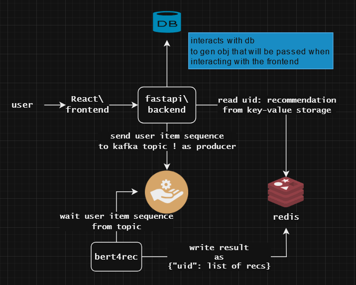

## ru-RU Описание
---

Проект представляет собой демонстрацию работы современной рекомендательной системы. Проект представляет собой демонстрацию работы современной рекомендательной системы.

## Архитектура

- Kafka: используется для управления потоками событий. При обновлении последовательности взаимодействий пользователя с объектами kafka передает данные используя json схему на сервис, где работает модель.
- Redis: применяется для кэширования и быстрого доступа к данным после генерации рекомендаций.
- Python-RecBole: библиотека для построения и тестирования рекомендательных систем, которая включает в себя различные алгоритмы и модели, включая BERT4Rec.
- FastAPI: высокопроизводительный веб-фреймворк для создания API, обеспечивающий взаимодействие между различными компонентами системы.
- React: фронтенд-библиотека для создания интерактивных пользовательских интерфейсов, позволяющая легко интегрироваться с FastAPI и предоставлять удобный доступ к рекомендациям.

    

